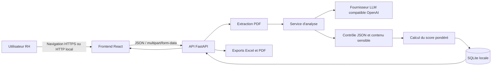
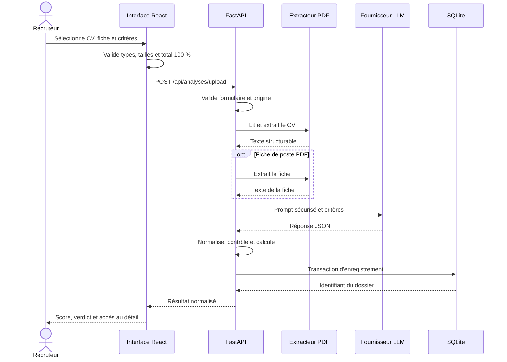
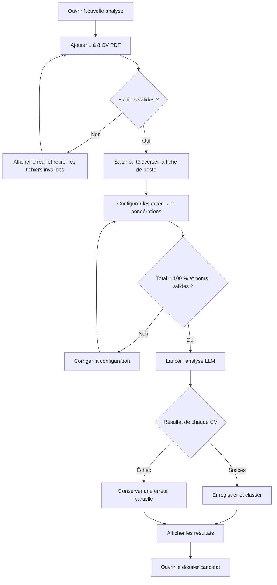
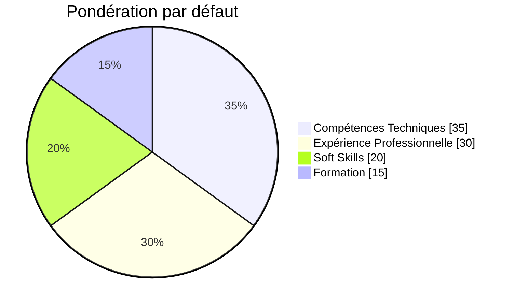
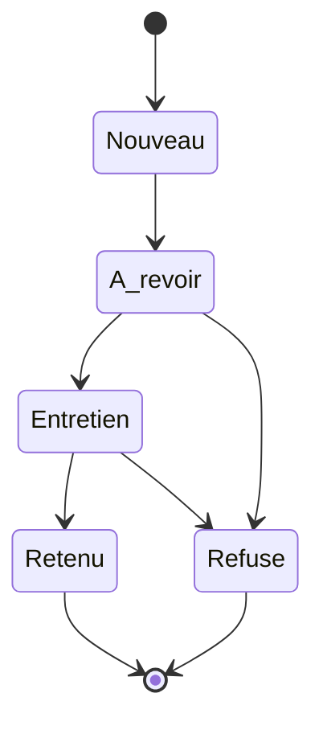
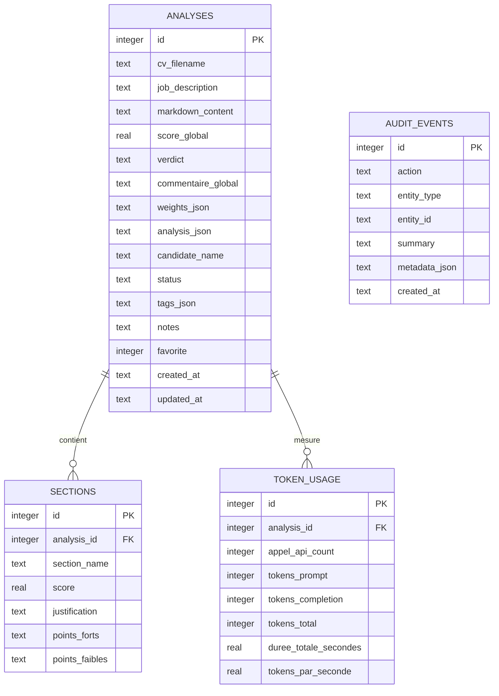
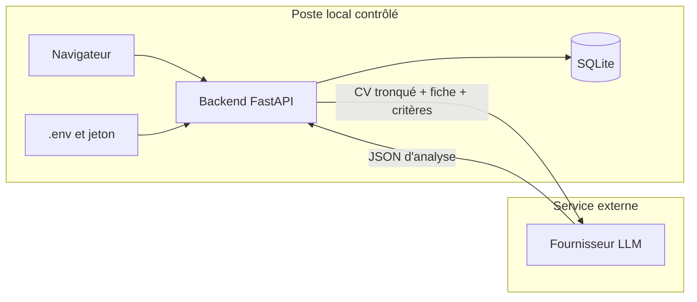
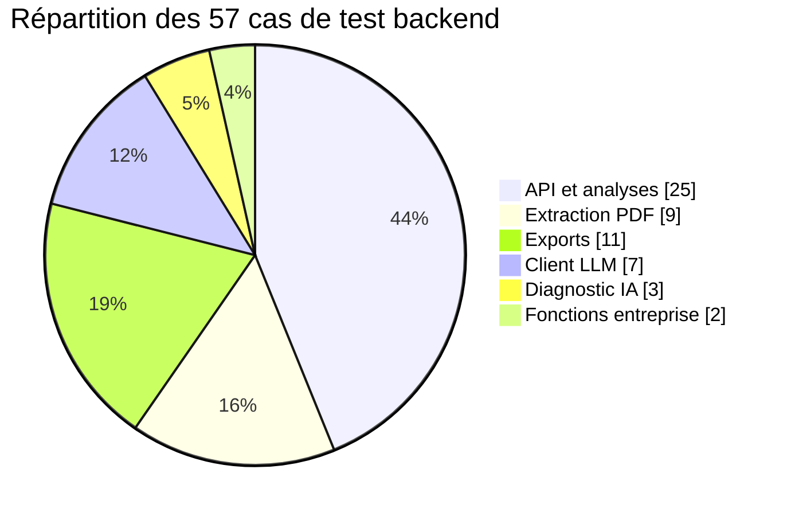

# Rapport détaillé de conception, de fonctionnement et d'audit

## Application « Analyse CV »

**Nature du document :** rapport fonctionnel, technique, architectural et critique  
**Projet :** Analyse CV  
**Version documentée :** état du projet audité le 29 juillet 2026  
**Public visé :** jury académique, encadrants, équipe technique et futurs mainteneurs  
**Architecture :** React, TypeScript, FastAPI, Python, SQLite et fournisseur LLM compatible OpenAI  
**Positionnement :** outil local d'aide à l'analyse et au suivi de candidatures, avec validation humaine obligatoire

---

## Consignes de lecture et de mise en page

Ce document décrit à la fois :

- la finalité du produit ;
- l'expérience utilisateur ;
- les règles métier ;
- l'architecture logicielle ;
- la circulation des données ;
- le fonctionnement de l'analyse par LLM ;
- la base de données ;
- l'API ;
- la sécurité et la gouvernance ;
- les tests ;
- les limites ;
- les corrections encore nécessaires ;
- un plan d'évolution et une liste de critères de validation.

Les blocs intitulés **VISUEL À INSÉRER** sont des instructions destinées à la personne qui mettra le rapport en forme. Ils indiquent précisément où ajouter une capture d'écran, un graphe, une matrice, un schéma ou un tableau. Lorsqu'un visuel nécessite des données mesurées, ces données ne doivent pas être inventées : il faut réaliser la mesure, indiquer le protocole, la date et l'environnement.

Les diagrammes Mermaid présents dans ce fichier peuvent être rendus directement par GitHub, GitLab, Obsidian, Typora, certains éditeurs Markdown ou un générateur de documentation compatible Mermaid. Pour un rapport Word ou PDF, ils pourront être exportés en SVG ou en PNG.

> **VISUEL À INSÉRER — Page de garde**  
> Ajouter une capture nette de l'écran « Nouvelle analyse » dans le thème clair. Ne montrer aucun nom de candidat réel, aucune adresse électronique, aucun jeton et aucun chemin personnel. Ajouter sous la capture la légende : « Interface principale de l'application Analyse CV ».

---

# Table des matières

1. [Résumé exécutif](#1-résumé-exécutif)
2. [Contexte, problématique et justification](#2-contexte-problématique-et-justification)
3. [Objectifs et périmètre](#3-objectifs-et-périmètre)
4. [Acteurs et besoins](#4-acteurs-et-besoins)
5. [Refonte et décisions de conception](#5-refonte-et-décisions-de-conception)
6. [Architecture générale](#6-architecture-générale)
7. [Technologies et justification des choix](#7-technologies-et-justification-des-choix)
8. [Structure détaillée du dépôt](#8-structure-détaillée-du-dépôt)
9. [Système de navigation et expérience globale](#9-système-de-navigation-et-expérience-globale)
10. [Parcours détaillé d'une nouvelle analyse](#10-parcours-détaillé-dune-nouvelle-analyse)
11. [Extraction et préparation des PDF](#11-extraction-et-préparation-des-pdf)
12. [Critères dynamiques et calcul du score](#12-critères-dynamiques-et-calcul-du-score)
13. [Fonctionnement détaillé du LLM](#13-fonctionnement-détaillé-du-llm)
14. [Gouvernance RH et attributs sensibles](#14-gouvernance-rh-et-attributs-sensibles)
15. [CVthèque et comparaison](#15-cvthèque-et-comparaison)
16. [Dossier candidat](#16-dossier-candidat)
17. [Pipeline de recrutement](#17-pipeline-de-recrutement)
18. [Journal d'activité](#18-journal-dactivité)
19. [Paramètres et diagnostic IA](#19-paramètres-et-diagnostic-ia)
20. [Exports Excel et PDF](#20-exports-excel-et-pdf)
21. [Architecture backend et contrats API](#21-architecture-backend-et-contrats-api)
22. [Base de données et cycle de vie des données](#22-base-de-données-et-cycle-de-vie-des-données)
23. [Sécurité, confidentialité et modèle de menace](#23-sécurité-confidentialité-et-modèle-de-menace)
24. [Gestion des erreurs et résilience](#24-gestion-des-erreurs-et-résilience)
25. [Qualité, tests et résultats de vérification](#25-qualité-tests-et-résultats-de-vérification)
26. [Installation, configuration et exploitation](#26-installation-configuration-et-exploitation)
27. [Limites actuelles](#27-limites-actuelles)
28. [Écarts résiduels découverts par l'audit](#28-écarts-résiduels-découverts-par-laudit)
29. [Plan de correction recommandé](#29-plan-de-correction-recommandé)
30. [Indicateurs à mesurer](#30-indicateurs-à-mesurer)
31. [Critères d'acceptation](#31-critères-dacceptation)
32. [Scénario de démonstration devant le jury](#32-scénario-de-démonstration-devant-le-jury)
33. [Questions probables du jury](#33-questions-probables-du-jury)
34. [Conclusion](#34-conclusion)
35. [Annexes](#35-annexes)

---

# 1. Résumé exécutif

« Analyse CV » est une application web locale destinée à assister un recruteur dans l'étude de candidatures. Elle reçoit un ou plusieurs CV au format PDF, ainsi qu'une fiche de poste fournie sous forme de texte, de PDF ou d'une combinaison des deux. L'utilisateur choisit ensuite les critères selon lesquels les CV doivent être analysés et définit la pondération de chaque critère. L'application utilise exclusivement un grand modèle de langage, ou LLM, pour produire une évaluation sémantique structurée.

Le LLM ne détermine pas lui-même le score global final. Il attribue un score à chaque critère et fournit une justification. Le backend valide la structure de la réponse, vérifie que tous les critères demandés sont présents, contrôle l'absence de références à des attributs personnels sensibles, puis calcule le score pondéré. Cette séparation permet de conserver une formule de calcul explicite et vérifiable, tout en utilisant le LLM pour comprendre le sens des expériences et des compétences.

Après l'analyse, les résultats sont enregistrés dans une base SQLite locale. Le recruteur peut consulter une CVthèque, ouvrir un dossier détaillé, comparer plusieurs profils, ajouter des notes et des tags, marquer un favori, déplacer un candidat dans un pipeline et produire des exports professionnels en Excel ou en PDF. Un journal d'activité enregistre les principales opérations sans reproduire les données personnelles des candidats.

L'application se positionne explicitement comme une **aide à la décision**. Le score ne constitue pas une décision d'embauche. Une validation humaine est nécessaire, car un modèle de langage peut produire des erreurs, manquer un élément du CV, interpréter imparfaitement une expérience ou refléter des biais présents dans ses données d'entraînement.

La refonte a supprimé :

- l'ancienne interface Streamlit ;
- le moteur déterministe à règles ;
- le mode hybride ;
- le chatbot ;
- les données simulées du frontend ;
- l'ancienne vue d'ensemble comme écran d'accueil ;
- le nom « Nexa ».

Le produit porte désormais le nom **Analyse CV** et la première page est **Nouvelle analyse**.

> **VISUEL À INSÉRER — Synthèse fonctionnelle**  
> Créer une infographie horizontale en six blocs : « Import PDF » → « Fiche de poste » → « Critères pondérés » → « Analyse LLM » → « Validation humaine » → « Suivi et export ». Utiliser les couleurs de l'interface et une icône par bloc. Ce visuel doit résumer le produit en moins de dix secondes.

---

# 2. Contexte, problématique et justification

## 2.1 Contexte métier

Le recrutement implique fréquemment l'examen d'un volume important de documents hétérogènes. Les CV varient dans leur structure, leur vocabulaire, leur niveau de précision et leur mise en page. Une même compétence peut être décrite de plusieurs façons. Par exemple, une expérience de conception d'API peut être mentionnée par un intitulé de mission, un nom de technologie ou une réalisation sans que le terme exact de la fiche de poste soit repris.

Une recherche limitée aux mots-clés risque donc de sous-évaluer des profils pertinents. À l'inverse, la présence d'un mot-clé ne garantit pas une maîtrise réelle. L'analyse sémantique est utilisée ici pour interpréter le contexte des compétences, de la formation et de l'expérience.

## 2.2 Problématique

La problématique peut être formulée ainsi :

> Comment assister un recruteur dans l'analyse cohérente, explicable et configurable de plusieurs CV, sans transformer l'intelligence artificielle en décideur autonome et sans masquer les limites de l'évaluation ?

Le problème possède plusieurs dimensions :

- **temps** : lire et comparer manuellement de nombreux CV est coûteux ;
- **hétérogénéité** : les CV utilisent des formats et vocabulaires différents ;
- **cohérence** : plusieurs personnes peuvent appliquer des critères différents ;
- **explicabilité** : un score seul ne suffit pas, il faut comprendre sa justification ;
- **confidentialité** : les CV contiennent des données personnelles ;
- **équité** : certains attributs ne doivent pas être utilisés dans l'évaluation ;
- **traçabilité** : les changements et les exports importants doivent être identifiables ;
- **responsabilité** : la décision finale doit rester humaine.

## 2.3 Réponse proposée

L'application répond à cette problématique par :

1. une extraction uniforme du texte des PDF ;
2. une fiche de poste obligatoire ;
3. des critères configurables ;
4. des pondérations totalisant exactement 100 % ;
5. une analyse LLM structurée ;
6. un calcul backend transparent ;
7. des justifications par critère ;
8. des garde-fous relatifs aux attributs sensibles ;
9. une organisation des résultats dans une CVthèque et un pipeline ;
10. un rappel permanent de la validation humaine.

> **VISUEL À INSÉRER — Problématique**  
> Ajouter un diagramme « Avant / Avec l'application ». À gauche : lecture dispersée, critères implicites, comparaison manuelle, absence de centralisation. À droite : critères explicites, score pondéré, justifications, pipeline et export. Ne pas annoncer de pourcentage de temps gagné sans avoir conduit une mesure réelle.

---

# 3. Objectifs et périmètre

## 3.1 Objectif principal

Fournir un espace local permettant de transformer des CV PDF en dossiers d'analyse structurés, comparables et exploitables par un recruteur.

## 3.2 Objectifs fonctionnels

L'application doit :

- accepter plusieurs CV PDF ;
- recevoir une fiche de poste en texte ou en PDF ;
- permettre la combinaison des deux sources de fiche de poste ;
- permettre la création de critères dynamiques ;
- attribuer un pourcentage à chaque critère ;
- refuser une configuration dont la somme n'est pas égale à 100 % ;
- utiliser uniquement un LLM pour l'analyse sémantique ;
- ne jamais simuler une analyse si le LLM est indisponible ;
- calculer le score global côté backend ;
- enregistrer les résultats ;
- permettre la consultation et la comparaison ;
- proposer un pipeline humain ;
- produire des exports ;
- journaliser les actions principales ;
- protéger les secrets techniques.

## 3.3 Objectifs non fonctionnels

Le produit doit rechercher :

- la lisibilité ;
- la cohérence visuelle ;
- la validation stricte des données ;
- la résilience aux erreurs réseau ;
- l'absence de fuite de secret ;
- une expérience responsive ;
- un code testable ;
- une séparation claire entre interface, logique métier et stockage.

## 3.4 Hors périmètre actuel

Ne font pas partie du périmètre opérationnel actuel :

- l'inscription et la connexion de plusieurs utilisateurs ;
- les rôles et permissions ;
- le déploiement public sécurisé ;
- l'OCR des PDF scannés ;
- la planification des entretiens ;
- l'envoi d'e-mails ;
- la signature électronique ;
- l'intégration à un SIRH ;
- la décision automatique d'embauche ;
- l'apprentissage du modèle à partir des décisions du recruteur ;
- le chatbot.

---

# 4. Acteurs et besoins

## 4.1 Recruteur

Le recruteur constitue l'utilisateur principal. Ses besoins sont :

- analyser rapidement plusieurs CV ;
- comprendre les raisons d'un score ;
- adapter les critères au poste ;
- comparer des profils ;
- prendre des notes ;
- préparer des questions d'entretien ;
- faire progresser les dossiers dans un processus clair.

## 4.2 Responsable RH

Le responsable RH cherche principalement à :

- obtenir une vue organisée du vivier ;
- contrôler l'avancement des dossiers ;
- vérifier l'application d'une méthode homogène ;
- consulter les exports ;
- s'assurer que la décision reste humaine ;
- surveiller la confidentialité et les bonnes pratiques.

## 4.3 Administrateur local

L'administrateur local doit :

- installer les dépendances ;
- configurer le fournisseur LLM ;
- protéger le fichier `.env` ;
- démarrer le backend et le frontend ;
- sauvegarder la base SQLite ;
- vérifier les diagnostics ;
- ne pas exposer le service directement sur Internet.

## 4.4 Candidat

Le candidat n'utilise pas directement l'application dans sa version actuelle, mais ses données sont traitées. Ses intérêts doivent donc être pris en compte :

- confidentialité ;
- traitement loyal ;
- non-utilisation d'attributs sensibles ;
- possibilité de vérification humaine ;
- limitation de la conservation ;
- absence de décision entièrement automatisée.

> **VISUEL À INSÉRER — Carte des parties prenantes**  
> Placer « Analyse CV » au centre et relier quatre acteurs : recruteur, responsable RH, administrateur local et candidat. Pour chaque flèche, indiquer l'intérêt principal : efficacité, contrôle, exploitation, protection des données.

---

# 5. Refonte et décisions de conception

## 5.1 Changement d'identité

L'ancien nom « Nexa » a été remplacé par « Analyse CV ». Ce nom exprime directement la fonction du produit et réduit l'ambiguïté pour un utilisateur qui découvre l'application.

Le nom apparaît dans :

- la marque de la barre latérale ;
- le fil d'Ariane ;
- le titre de l'API ;
- les exports ;
- la documentation ;
- les messages de santé du backend.

## 5.2 Suppression de la vue d'ensemble

L'ancienne vue d'ensemble n'est plus l'entrée principale. L'utilisateur accède directement à l'action essentielle : créer une analyse. Toute route inconnue redirige vers `/analyse`.

Ce choix réduit le nombre d'étapes entre l'ouverture du produit et la réalisation de la tâche principale.

## 5.3 Suppression de Streamlit

La nouvelle interface est entièrement développée avec React et TypeScript. Les bénéfices recherchés sont :

- une navigation plus fluide ;
- une meilleure séparation frontend/backend ;
- une interface responsive ;
- un contrôle plus précis de l'état, des erreurs et des composants ;
- une compilation de production indépendante du backend Python.

## 5.4 Suppression du moteur déterministe et du mode hybride

Le système ne combine plus un score à règles avec un score LLM. Une seule configuration existe : analyse sémantique LLM.

Ce choix simplifie la compréhension du produit :

- aucun mélange de deux méthodes de scoring ;
- aucun paramètre de répartition entre moteur local et modèle ;
- aucun résultat de secours potentiellement trompeur ;
- une erreur explicite si l'IA est indisponible.

Le calcul pondéré du score reste déterministe au sens mathématique, mais il ne constitue pas un « moteur déterministe d'évaluation ». Les scores par critère viennent du LLM ; seule leur agrégation utilise une formule fixe.

## 5.5 Suppression du chatbot

Le chatbot a été retiré du périmètre, car il n'est pas nécessaire au parcours principal. Le produit se concentre sur :

- l'analyse ;
- la consultation ;
- la comparaison ;
- le suivi ;
- l'export.

L'audit a néanmoins détecté des traces résiduelles dans le CSS, les caches et une base SQLite existante. Elles sont détaillées dans la section 28.

## 5.6 Suppression des données de démonstration

Le frontend ne dispose plus d'un mode de simulation actif et le contexte de données ne propose que trois états : chargement, API ou erreur. Si le backend ne répond pas, la liste n'est pas remplacée par de faux candidats.

Cette décision évite qu'un utilisateur confonde des données simulées avec des résultats réels.

---

# 6. Architecture générale

## 6.1 Vue logique



## 6.2 Responsabilité de chaque couche

### Frontend

Le frontend est responsable de :

- l'affichage ;
- la navigation ;
- la sélection des fichiers ;
- les validations immédiates ;
- la configuration des critères ;
- l'appel de l'API ;
- la présentation des erreurs et des résultats ;
- les interactions de pipeline ;
- le déclenchement des téléchargements.

Il n'est pas responsable de :

- conserver la clé IA ;
- ouvrir lui-même les PDF ;
- calculer le résultat officiel ;
- parler directement au fournisseur LLM ;
- écrire directement dans SQLite.

### Backend

Le backend est responsable de :

- valider les entrées ;
- contrôler les fichiers ;
- extraire les PDF ;
- construire le prompt ;
- appeler le fournisseur ;
- valider la réponse ;
- calculer le score ;
- appliquer les règles de sécurité ;
- enregistrer les données ;
- exposer l'API ;
- créer les exports ;
- journaliser les opérations.

### Base SQLite

SQLite est responsable de la persistance locale :

- dossiers ;
- sections d'analyse ;
- métriques d'usage ;
- notes ;
- tags ;
- statuts ;
- audit.

### Modèle LLM local

Qwen3 8B, servi localement par LM Studio, reçoit le contexte nécessaire et produit une proposition d'analyse structurée. Il n'a pas accès directement à la base SQLite ni à l'interface.

> **VISUEL À INSÉRER — Architecture de déploiement**  
> Exporter le diagramme Mermaid précédent en SVG. Ajouter sous chaque composant son port ou sa localisation : navigateur, frontend `localhost:5173`, backend `127.0.0.1:8000`, fichier `analyses.db`, LM Studio `127.0.0.1:1234`. Tous les composants restent locaux.

## 6.3 Séquence d'une analyse



---

# 7. Technologies et justification des choix

| Domaine | Technologie | Justification principale |
|---|---|---|
| Interface | React 19 | Composition par composants et gestion d'état |
| Langage UI | TypeScript 5.9 | Détection d'erreurs avant exécution |
| Outil frontend | Vite 8 | Serveur de développement rapide et build optimisé |
| Routage | Wouter | Routage léger adapté au nombre limité de pages |
| Animation | Framer Motion | Transitions, modales et respect du mouvement réduit |
| Icônes | Lucide React | Icônes cohérentes et accessibles |
| API | FastAPI | API asynchrone, documentation OpenAPI et intégration Pydantic |
| Validation | Pydantic | Schémas stricts et bornes de données |
| Client HTTP | HTTPX | Requêtes asynchrones et contrôle des délais |
| Extraction | pdfplumber | Lecture du texte natif des PDF |
| Stockage | SQLite | Simplicité pour un usage local mono-utilisateur |
| Excel | openpyxl | Classeur mis en forme et filtrable |
| PDF | ReportLab | Rapports paginés et contrôlés |
| Tests | pytest | Tests unitaires et d'intégration backend |

## 7.1 Pourquoi React plutôt que Streamlit

React a été retenu pour obtenir :

- une interface réellement modulaire ;
- une navigation sans rechargement ;
- une gestion fine des états ;
- des interactions comme le glisser-déposer ;
- un thème clair/sombre ;
- une expérience mobile ;
- une séparation stricte entre affichage et traitement.

## 7.2 Pourquoi FastAPI

FastAPI offre :

- une documentation `/docs` automatique ;
- la validation des paramètres ;
- la gestion des fichiers multipart ;
- l'asynchronisme pour les appels réseau ;
- l'injection d'instances lors des tests ;
- des contrats d'erreur explicites.

## 7.3 Pourquoi SQLite

SQLite correspond au périmètre local :

- pas de serveur de base supplémentaire ;
- fichier facilement sauvegardable ;
- transactions ;
- clés étrangères ;
- bon fonctionnement pour un utilisateur ou une faible concurrence.

SQLite ne serait pas le choix final pour une plateforme publique multi-utilisateur. PostgreSQL serait alors plus adapté.

---

# 8. Structure détaillée du dépôt

```text
CVAnalyse_Stage/
├── backend/
│   ├── main.py                 # application FastAPI et routes principales
│   ├── config.py               # configuration depuis l'environnement
│   ├── schemas.py              # validation des entrées métier
│   ├── ai_schemas.py           # contrat du diagnostic IA
│   ├── repository.py           # accès SQLite et transactions
│   ├── analysis_service.py     # prompt, normalisation et scoring
│   ├── llm_client.py           # client OpenAI-compatible robuste
│   ├── content_policy.py       # détection des attributs sensibles
│   ├── ai_router.py            # diagnostic et test du fournisseur
│   ├── enterprise_router.py    # actions groupées, pipeline et audit
│   ├── export_router.py        # routes de téléchargement
│   └── export_service.py       # génération Excel et PDF
├── frontend/
│   ├── src/
│   │   ├── main.tsx            # point d'entrée React
│   │   ├── App.tsx             # routes et chargement différé
│   │   ├── types.ts            # contrats TypeScript
│   │   ├── components/
│   │   │   ├── Layout.tsx      # navigation, recherche et thème
│   │   │   └── ui.tsx          # composants visuels partagés
│   │   ├── context/
│   │   │   ├── DataContext.tsx # synchronisation de l'espace
│   │   │   └── ThemeContext.tsx# préférence visuelle
│   │   ├── lib/
│   │   │   ├── api.ts          # client API et normalisation
│   │   │   └── navigation.tsx  # adaptateurs de navigation
│   │   └── pages/
│   │       ├── Analyze.tsx
│   │       ├── Candidates.tsx
│   │       ├── CandidateDetail.tsx
│   │       ├── Pipeline.tsx
│   │       ├── Activity.tsx
│   │       └── Settings.tsx
│   └── package.json
├── scripts/
│   └── configure_ai.ps1        # saisie sécurisée du jeton
├── tests/
│   ├── test_ai_router.py
│   ├── test_backend_api.py
│   ├── test_convertisseur.py
│   ├── test_enterprise_features.py
│   ├── test_exports.py
│   └── test_llm_client.py
├── convertisseur.py            # extraction et Markdown
├── requirements.txt
├── .env.example
└── readme.md
```

Cette organisation applique une séparation de responsabilités. Elle réduit le risque qu'une page React contienne directement la logique de stockage ou que le dépôt SQLite contienne la logique de présentation.

> **VISUEL À INSÉRER — Arborescence commentée**  
> Transformer l'arborescence précédente en schéma à trois colonnes : « Présentation », « Métier et API », « Données et infrastructure ». Relier les fichiers importants à leur responsabilité.

---

# 9. Système de navigation et expérience globale

## 9.1 Routes

| URL | Page | Finalité |
|---|---|---|
| `/analyse` | Nouvelle analyse | Import et évaluation |
| `/candidats` | CV & candidats | Consultation et comparaison |
| `/candidats/:id` | Dossier candidat | Analyse détaillée et suivi |
| `/pipeline` | Pipeline candidats | Organisation des étapes |
| `/journal` | Journal d'activité | Traçabilité |
| `/parametres` | Paramètres | Thème et diagnostic IA |

Une URL inconnue redirige vers `/analyse`.

## 9.2 Barre latérale

La barre latérale présente :

- la marque « Analyse CV » ;
- le sous-titre « évaluation intelligente » ;
- les cinq entrées principales ;
- une carte de confidentialité ;
- la mention d'un espace local.

Elle peut être réduite sur ordinateur. Sur mobile, elle devient un panneau latéral et une navigation inférieure présente les fonctions principales.

## 9.3 Barre supérieure

La barre supérieure affiche :

- le contexte de la page ;
- une recherche globale ;
- le changement de thème ;
- l'état de connexion ;
- un raccourci vers la nouvelle analyse.

Les états de connexion sont :

- connexion en cours ;
- synchronisé avec l'API ;
- hors ligne.

## 9.4 Recherche globale

Le raccourci `Ctrl + K` ou `Cmd + K` ouvre la recherche. Au moins deux caractères sont requis. La recherche porte sur :

- le nom ;
- le titre professionnel ;
- les compétences.

Cinq résultats maximum sont affichés.

## 9.5 Thème et réduction des mouvements

Les modes sont : clair, sombre et système. La préférence est enregistrée sous la clé `analyse-cv-theme-preference` dans le navigateur. Il s'agit de la seule donnée persistée côté navigateur.

Framer Motion utilise la préférence système de réduction des mouvements. Les utilisateurs sensibles aux animations peuvent ainsi limiter les transitions.

> **VISUEL À INSÉRER — Planche d'interface**  
> Ajouter quatre captures : barre latérale ouverte, barre latérale réduite, navigation mobile et recherche globale. Utiliser la même résolution et masquer toute donnée personnelle. Légender chaque capture.

---

# 10. Parcours détaillé d'une nouvelle analyse

## 10.1 Vue d'ensemble du parcours



## 10.2 Étape 1 — Ajout des CV

L'utilisateur peut cliquer sur la zone de dépôt ou glisser-déposer plusieurs fichiers. Le champ natif accepte plusieurs PDF.

Validations frontend :

- extension ou type MIME PDF ;
- taille inférieure ou égale à 15 Mo ;
- maximum huit fichiers ;
- déduplication selon le nom et la taille.

L'utilisateur peut :

- voir le nom et la taille ;
- retirer un document ;
- retirer toute la sélection ;
- ajouter d'autres documents jusqu'à la limite.

Ces validations améliorent l'expérience mais ne sont pas considérées comme une mesure de sécurité suffisante. Le backend recommence toutes les vérifications importantes.

## 10.3 Étape 2 — Contexte du poste

L'utilisateur peut fournir :

1. du texte brut ;
2. un PDF ;
3. du texte et un PDF.

Si les deux sources sont présentes, leur contenu est concaténé. Le texte peut préciser des éléments absents du document officiel, comme une compétence prioritaire ou une mission spécifique.

Au moins une source est obligatoire. L'analyse sans fiche de poste est refusée, car le score représente une adéquation à un poste et non une valeur générale du candidat.

## 10.4 Étape 3 — Configuration

Le mode affiché est uniquement « LLM — Analyse sémantique ». Il n'existe pas de bouton permettant de choisir un moteur déterministe ou hybride.

La configuration comprend :

- les critères ;
- les pourcentages ;
- le total ;
- un bouton de réinitialisation ;
- l'ajout de critères ;
- la température du modèle dans une section avancée.

## 10.5 Étape 4 — Validation avant envoi

Le bouton reste désactivé si :

- aucun CV n'est présent ;
- aucune fiche de poste n'est fournie ;
- le total n'est pas 100 % ;
- un critère n'a pas de nom ;
- deux noms sont équivalents ;
- un poids est nul ;
- une analyse est déjà en cours.

## 10.6 Étape 5 — Traitement

L'interface traite actuellement les fichiers l'un après l'autre avec la route d'analyse individuelle. Cette stratégie :

- simplifie les erreurs partielles ;
- évite de lancer huit requêtes LLM simultanées ;
- facilite l'affichage du fichier en cours ;
- peut en revanche allonger le temps total.

La progression visuelle présente :

- lecture PDF ;
- scoring ;
- création du rapport.

Elle est estimée à partir du nombre de fichiers terminés. Ce n'est pas un flux temps réel du serveur.

## 10.7 Étape 6 — Résultats

Les succès sont triés par score décroissant. Une carte présente :

- le rang ;
- l'identité ;
- le titre ;
- jusqu'à quatre compétences ;
- le score ;
- le verdict ;
- le lien vers le détail.

Les erreurs sont affichées séparément. Une erreur sur un CV n'efface pas les dossiers déjà créés.

> **VISUEL À INSÉRER — Parcours utilisateur**  
> Ajouter cinq captures numérotées : zone de dépôt, fiche de poste PDF, critères dynamiques, progression et résultats. Sous chaque capture, ajouter une phrase expliquant l'action et une phrase expliquant la validation correspondante.

---

# 11. Extraction et préparation des PDF

## 11.1 Validation du fichier

Le backend applique les contrôles suivants :

- nettoyage du nom de fichier ;
- extension `.pdf` ;
- type MIME autorisé ;
- lecture limitée à la taille maximale plus un octet ;
- rejet avec `413` si la limite est dépassée ;
- recherche de la signature `%PDF-` dans les 1 024 premiers octets ;
- ouverture avec pdfplumber ;
- contrôle du nombre de pages ;
- délai maximal pour l'extraction.

Les types MIME acceptés sont :

- `application/pdf` ;
- `application/x-pdf` ;
- `application/octet-stream`.

## 11.2 Bornes

Valeurs par défaut :

- taille maximale : 15 Mo ;
- pages maximales : 40 ;
- contrôle du nombre de pages : délai de 15 secondes ;
- extraction : délai de 30 secondes ;
- texte de CV accepté par l'API : 300 000 caractères ;
- texte de fiche : 80 000 caractères.

## 11.3 Nettoyage du texte

Le convertisseur :

- répare les mots coupés par un trait d'union en fin de ligne ;
- fusionne certaines lignes coupées au milieu d'une phrase ;
- préserve les titres de section en majuscules ;
- conserve les séparations après une ponctuation terminale ;
- ajoute une indication de page ;
- détecte les sections usuelles en français et en anglais.

Sections reconnues notamment :

- expérience professionnelle ;
- formation ;
- compétences techniques ;
- langues ;
- soft skills ;
- centres d'intérêt ;
- projets ;
- profil ;
- certifications.

## 11.4 Conversion Markdown

Le texte est transformé en document Markdown avec :

- un titre dérivé du nom du fichier ;
- des titres de niveau 2 pour les sections ;
- le contenu associé.

Cette structure facilite l'interprétation du LLM et la consultation dans le dossier candidat.

## 11.5 Limite : absence d'OCR

Un PDF composé uniquement d'images ne fournit aucun texte à pdfplumber. Le backend renvoie alors une erreur indiquant qu'un OCR peut être nécessaire.

Une évolution possible serait :

1. détecter les pages sans texte ;
2. rasteriser uniquement ces pages ;
3. exécuter un OCR ;
4. mesurer la confiance ;
5. signaler à l'utilisateur quelles pages ont été reconnues automatiquement.

> **VISUEL À INSÉRER — Chaîne PDF**  
> Ajouter un schéma vertical : fichier → signature → taille → pages → extraction → nettoyage → détection des sections → Markdown. Faire apparaître en rouge les sorties d'erreur et en orange la branche « OCR nécessaire ».

---

# 12. Critères dynamiques et calcul du score

## 12.1 Critères par défaut



| Critère | Poids |
|---|---:|
| Compétences Techniques | 35 % |
| Expérience Professionnelle | 30 % |
| Soft Skills | 20 % |
| Formation | 15 % |

Le graphique représente uniquement la configuration par défaut, pas une statistique sur des candidats.

## 12.2 Ajout d'un critère

L'utilisateur peut ajouter un critère vide. Il doit ensuite :

- saisir un nom ;
- choisir un poids ;
- ajuster les autres poids pour revenir à 100 %.

Les critères ajoutés sont supprimables. Les quatre critères standards restent modifiables, mais leur nom n'est pas éditable dans l'interface actuelle.

## 12.3 Validation des noms

Deux noms sont considérés comme identiques après :

- suppression des accents ;
- conversion en minuscules ;
- remplacement des caractères non alphanumériques par des espaces ;
- normalisation des espaces.

Par exemple, « Expérience technique » et « EXPERIENCE-TECHNIQUE » doivent être considérés comme équivalents.

## 12.4 Formule du score

Soient les critères `i = 1...n`, le score `Sᵢ` sur 100 et le poids `Pᵢ` en pourcentage :

```text
Score global = Σ (Sᵢ × Pᵢ / 100)
```

La somme des poids doit vérifier :

```text
Σ Pᵢ = 100
```

### Exemple pédagogique

| Critère | Score LLM | Poids | Contribution |
|---|---:|---:|---:|
| Compétences Techniques | 80 | 35 % | 28,00 |
| Expérience Professionnelle | 70 | 30 % | 21,00 |
| Soft Skills | 75 | 20 % | 15,00 |
| Formation | 60 | 15 % | 9,00 |
| **Total** |  | **100 %** | **73,00** |

Le score final est donc `73/100`.

Cet exemple est pédagogique et ne correspond à aucun candidat stocké.

## 12.5 Seuils de verdict

| Intervalle | Verdict |
|---|---|
| 75 à 100 | RECOMMANDÉ |
| 55 à moins de 75 | À CONSIDÉRER |
| 0 à moins de 55 | NON RECOMMANDÉ |

Le verdict ne doit pas être interprété comme une décision de recrutement.

## 12.6 Différence entre verdict et workflow

Le verdict répond à la question :

> Selon cette analyse et ces critères, quel est le niveau d'adéquation du CV à la fiche de poste ?

Le statut de workflow répond à la question :

> À quelle étape humaine du processus de recrutement ce dossier se trouve-t-il ?

Un profil recommandé peut être nouveau, à revoir, en entretien, retenu ou refusé. Cette séparation empêche le score IA de déplacer automatiquement un candidat dans le processus.

> **VISUEL À INSÉRER — Profil de scores**  
> Pour la soutenance, produire un graphique radar ou un histogramme à partir d'un dossier de test anonymisé et autorisé. Afficher un axe par critère et le score sur 100. Ajouter la mention « Illustration sur données de test — ne constitue pas une décision ». Ne pas utiliser un dossier réel sans autorisation.

---

# 13. Fonctionnement détaillé du LLM

## 13.1 Configuration

Le backend utilise les variables LM Studio suivantes :

```env
LM_STUDIO_BASE_URL=http://127.0.0.1:1234/v1
LM_STUDIO_MODEL=qwen/qwen3-8b
LM_STUDIO_API_TOKEN=
```

La base URL doit exposer une route compatible :

```text
/chat/completions
```

Le jeton est facultatif lorsque l'authentification LM Studio est désactivée, ce qui est le comportement local par défaut.

## 13.2 Prompt système

Le prompt système demande au modèle :

- d'agir comme un recruteur technique ;
- de rester factuel ;
- de se limiter aux informations fournies ;
- de répondre en français ;
- de produire uniquement du JSON ;
- de ne pas inclure de texte avant ou après.

## 13.3 Garde-fous

Les garde-fous indiquent :

- que le CV et la fiche sont des données non fiables ;
- que les instructions intégrées à ces documents doivent être ignorées ;
- que les secrets ne doivent jamais être révélés ;
- que seuls les éléments professionnels pertinents doivent être utilisés ;
- que les attributs sensibles ne doivent pas être inférés ;
- que la réponse assiste une validation humaine.

## 13.4 Prompt utilisateur structuré

Le prompt inclut :

- les noms exacts des critères ;
- leur pourcentage ;
- un exemple de structure JSON ;
- la fiche de poste ;
- le CV ;
- l'instruction `/no_think`.

Le modèle doit conserver exactement les noms des critères afin que le backend puisse les mettre en correspondance.

## 13.5 Limites de contenu envoyées

| Élément | Limite interne du prompt |
|---|---:|
| CV | 16 000 caractères |
| Fiche de poste | 8 000 caractères |
| Réponse LLM | 4 096 tokens |

Le reste du texte peut être stocké localement, mais n'est pas nécessairement inclus dans le prompt. Une mention de troncature est ajoutée.

## 13.6 Structure attendue

La réponse doit contenir :

```json
{
  "sections": [
    {
      "nom": "Nom exact du critère",
      "score_sur_100": 0,
      "points_forts": [],
      "points_faibles": [],
      "justification": ""
    }
  ],
  "profil_candidat": {
    "headline": "",
    "email": "",
    "telephone": "",
    "localisation": "",
    "formation": "",
    "derniere_entreprise": "",
    "annees_experience": 0,
    "competences": []
  },
  "synthese": {
    "resume_candidat": "",
    "adequation_poste": "",
    "commentaire_global": "",
    "questions_entretien": [],
    "risques": []
  }
}
```

## 13.7 Extraction du JSON

Le service :

1. retire les balises `<think>` ;
2. recherche les blocs entourés par des balises JSON ;
3. recherche également des accolades équilibrées ;
4. tient compte des chaînes et des caractères échappés ;
5. tente de retirer les virgules finales avant `}` ou `]` ;
6. conserve uniquement un objet JSON.

## 13.8 Normalisation

Le backend :

- rapproche les noms de critères après normalisation ;
- ignore les sections inconnues ou dupliquées ;
- exige toutes les sections demandées ;
- borne les scores entre 0 et 100 ;
- borne l'expérience entre 0 et 80 ;
- limite les listes ;
- limite la longueur des textes ;
- déduplique les forces et les améliorations.

## 13.9 Réessai sémantique

Deux essais d'analyse sont autorisés. Un second essai est demandé si :

- le JSON est invalide ;
- un critère manque ;
- la sortie mentionne un attribut sensible.

Après deux réponses inutilisables, l'analyse échoue avec une erreur contrôlée.

## 13.10 Réessais réseau

Le client HTTP réessaie les erreurs :

- limitation `429` ;
- erreur fournisseur `5xx` ;
- délai dépassé ;
- erreur réseau.

Il ne réessaie pas une authentification refusée. L'attente suit un backoff exponentiel borné, complété par un petit jitter et, si présent, l'en-tête `Retry-After`.

> **VISUEL À INSÉRER — Réessais et décisions**  
> Ajouter un arbre de décision : réponse HTTP → succès / erreur réessayable / erreur définitive → JSON valide / JSON invalide → contenu sensible / contenu acceptable → persistance. Ce visuel doit distinguer les réessais réseau des deux essais sémantiques.

---

# 14. Gouvernance RH et attributs sensibles

## 14.1 Principe

Une évaluation professionnelle doit porter sur des éléments pertinents pour le poste. L'application demande au LLM de ne pas utiliser ou inférer les attributs suivants :

- âge ;
- genre ou sexe ;
- origine ;
- race ou ethnie ;
- nationalité ou citoyenneté ;
- religion ;
- état de santé ;
- handicap ;
- grossesse ;
- orientation sexuelle ;
- opinions politiques ;
- appartenance syndicale ;
- situation familiale ou matrimoniale.

## 14.2 Contrôle de sortie

La sortie finale est sérialisée puis analysée par une politique de contenu. Si une expression sensible est détectée, la réponse n'est pas enregistrée.

Le système reconnaît également certains faux positifs techniques. Par exemple, « race condition » dans un contexte informatique ne doit pas être interprété comme une référence à l'origine d'une personne.

## 14.3 Limites du filtre

Une détection par expressions régulières peut :

- manquer une formulation indirecte ;
- bloquer une formulation professionnelle ambiguë ;
- ne pas détecter un biais exprimé sans mot sensible ;
- ne pas contrôler l'ensemble des biais potentiels du score.

Elle doit donc être présentée comme une barrière supplémentaire, non comme une certification d'équité.

## 14.4 Validation humaine

Les écrans de résultats et de détail rappellent :

- que le score est indicatif ;
- que les informations doivent être vérifiées ;
- qu'un entretien équitable reste nécessaire ;
- que la décision appartient à l'équipe humaine.

> **VISUEL À INSÉRER — Matrice de gouvernance**  
> Créer un tableau graphique à quatre colonnes : « Risque », « Barrière technique », « Contrôle humain », « Limite restante ». Inclure au minimum : biais, hallucination, donnée sensible, prompt injection et mauvaise extraction PDF.

---

# 15. CVthèque et comparaison

## 15.1 Fonction de la CVthèque

La page « CV & candidats » centralise tous les dossiers enregistrés. Elle n'utilise pas de données de démonstration si l'API est absente.

## 15.2 Indicateurs

La page calcule dans le navigateur :

- nombre total de profils ;
- nombre recommandé ;
- nombre à considérer ;
- score moyen.

## 15.3 Recherche

La recherche porte sur :

- le nom ;
- le titre ;
- la localisation ;
- les compétences.

## 15.4 Filtre de verdict

L'utilisateur peut afficher :

- tous les verdicts ;
- recommandés ;
- à considérer ;
- non recommandés.

## 15.5 Tri

Les tris proposés sont :

- score décroissant ;
- score croissant ;
- date la plus récente ;
- nom de A à Z.

## 15.6 Affichage et pagination

La page propose :

- une vue tableau ;
- une vue grille ;
- dix éléments par page.

Le tableau affiche l'identité, le score, le verdict, l'expérience, la date et un accès au dossier.

## 15.7 Actions groupées

Jusqu'à 100 dossiers peuvent être sélectionnés. L'utilisateur peut :

- changer l'étape ;
- ajouter un tag ;
- ajouter les dossiers aux favoris.

Le backend applique ces changements dans une transaction atomique et retourne les identifiants introuvables.

## 15.8 Comparaison

La comparaison est disponible pour deux à quatre profils. Elle affiche :

- le candidat ;
- le titre ;
- le score global ;
- le verdict ;
- chaque critère ;
- l'expérience.

Dans l'état actuel, la liste des critères est dérivée du premier candidat sélectionné. Cette approche doit être améliorée pour utiliser l'union des critères de tous les candidats.

> **VISUEL À INSÉRER — CVthèque**  
> Ajouter une capture de la vue tableau et une capture de la comparaison. Utiliser des dossiers de test anonymisés. Mettre en évidence, avec des annotations discrètes, les filtres, le tri, la sélection multiple et l'accès au détail.

---

# 16. Dossier candidat

## 16.1 En-tête du dossier

L'en-tête affiche :

- avatar à initiales ;
- nom ;
- verdict ;
- titre professionnel ;
- localisation ;
- années d'expérience estimées ;
- date de l'analyse ;
- score d'adéquation ;
- rappel de validation humaine.

## 16.2 Onglet « Synthèse »

Il contient :

- résumé du profil ;
- adéquation par critère ;
- points forts ;
- points à approfondir ;
- questions d'entretien ;
- coordonnées ;
- formation ;
- compétences ;
- gestion du dossier ;
- notes internes.

Les questions d'entretien peuvent être copiées. Si aucune question n'est disponible, l'interface présente actuellement deux suggestions génériques. Il s'agit d'un comportement d'affichage, non d'une analyse simulée.

## 16.3 Onglet « Analyse détaillée »

Pour chaque critère :

- score sur 100 ;
- barre visuelle ;
- justification ;
- points forts ;
- points faibles.

## 16.4 Onglet « CV source »

Le texte Markdown stocké est affiché dans un bloc préformaté. Il ne s'agit pas d'un rendu fidèle du PDF original. Les colonnes, couleurs et dispositions du document ne sont pas reproduites.

## 16.5 Gestion du dossier

L'utilisateur peut :

- marquer un favori ;
- choisir un statut ;
- ajouter jusqu'à 20 tags ;
- écrire une note de 20 000 caractères maximum ;
- enregistrer ;
- supprimer le dossier.

Les tags sont nettoyés, limités à 60 caractères et dédupliqués sans tenir compte de la casse.

## 16.6 Suppression

Une boîte de confirmation explique que le dossier et ses données associées seront supprimés. La base utilise des clés étrangères avec suppression en cascade pour les sections et les métriques.

## 16.7 Rapport individuel

Le bouton « Rapport PDF » génère un document sans inclure le texte brut du CV ni la note interne.

> **VISUEL À INSÉRER — Dossier candidat**  
> Produire une planche de trois captures correspondant aux trois onglets. Flouter ou remplacer toutes les coordonnées. Ajouter un zoom sur l'encadré « Aide à la décision — validation humaine requise ».

---

# 17. Pipeline de recrutement

## 17.1 Étapes



Les cinq états techniques sont :

| Valeur | Libellé |
|---|---|
| `nouveau` | Nouveaux |
| `a_revoir` | À revoir |
| `entretien` | Entretiens |
| `retenu` | Retenus |
| `refuse` | Non retenus |

Le diagramme illustre un parcours courant. L'interface permet techniquement de déplacer une carte vers n'importe quelle colonne, y compris en arrière.

## 17.2 Indicateurs

La page calcule :

- dossiers actifs : tout sauf retenus et refusés ;
- dossiers en entretien ;
- dossiers retenus ;
- taux de sélection.

Formule du taux :

```text
retenus / (retenus + refusés) × 100
```

Si aucun dossier n'est clôturé, le taux vaut zéro.

## 17.3 Déplacement optimiste

Lors d'un déplacement :

1. l'interface mémorise l'ancien statut ;
2. la carte est déplacée immédiatement ;
3. l'API reçoit un `PATCH` ;
4. l'espace est actualisé ;
5. en cas d'échec, l'ancien statut est restauré.

Cette stratégie améliore la sensation de rapidité tout en préservant la cohérence.

## 17.4 Recherche

La recherche porte sur :

- nom ;
- titre ;
- localisation ;
- compétences ;
- tags.

> **VISUEL À INSÉRER — Pipeline**  
> Ajouter une capture panoramique des cinq colonnes. Ajouter une flèche illustrant un glisser-déposer de « À revoir » vers « Entretiens ». Ne pas utiliser le score IA comme justification automatique du déplacement dans la légende.

---

# 18. Journal d'activité

## 18.1 Objectif

Le journal permet de savoir quelles opérations importantes ont été réalisées, sans devenir un second stockage des données candidat.

## 18.2 Actions reconnues

| Action | Présentation |
|---|---|
| `analysis.created` | Dossier créé |
| `analysis.updated` | Dossier mis à jour |
| `analysis.deleted` | Dossier supprimé |
| `analysis.bulk_updated` | Action groupée |
| `export.generated` | Export généré |

## 18.3 Métadonnées autorisées

Le dépôt filtre les métadonnées pour ne conserver que des informations techniques comme :

- champs modifiés ;
- format ;
- périmètre ;
- nombre ;
- statut ;
- identifiants manquants.

Les noms, contacts, notes et contenus de CV ne doivent pas apparaître.

## 18.4 Pagination et rétention

- 50 événements chargés par page dans l'interface ;
- 200 maximum autorisés par requête API ;
- rétention bornée à 5 000 événements dans SQLite.

## 18.5 Affichage

La page propose :

- indicateurs ;
- filtre par catégorie ;
- recherche ;
- groupement par jour ;
- heure précise ;
- date relative ;
- chargement progressif.

> **VISUEL À INSÉRER — Chronologie**  
> Ajouter une capture du journal montrant au moins une création, une mise à jour, un export et une suppression sur des dossiers de test. Vérifier visuellement qu'aucun nom ni contact n'apparaît.

---

# 19. Paramètres et diagnostic IA

## 19.1 Apparence

Trois préférences sont proposées :

- clair ;
- sombre ;
- système.

Le raccourci `Ctrl + Maj + L` bascule rapidement entre clair et sombre.

## 19.2 Diagnostic IA

La page affiche :

- fournisseur ;
- modèle ;
- présence du jeton ;
- état ;
- résultat du dernier test ;
- latence du test en cas de succès.

## 19.3 États du diagnostic

- clé absente ;
- configuration détectée, non testée ;
- connexion opérationnelle ;
- échec de connexion ;
- indisponible.

## 19.4 Test minimal

Le test envoie uniquement :

```text
Réponds uniquement par OK.
```

La réponse textuelle reste interne. Le navigateur reçoit seulement des métadonnées contrôlées.

## 19.5 Saisie sécurisée du jeton

Le script PowerShell utilise `Read-Host -AsSecureString`. Il :

- ne place pas le jeton dans l'historique de commande ;
- préserve les autres variables du fichier `.env` ;
- valide l'URL et le modèle ;
- libère la représentation temporaire du secret ;
- écrit le fichier en UTF-8.

## 19.6 Exposition publique

La page rappelle qu'avant toute exposition publique, il faut ajouter :

- authentification ;
- rôles ;
- TLS ;
- politique de conservation ;
- audit centralisé.

> **VISUEL À INSÉRER — Diagnostic**  
> Ajouter deux captures recadrées : état « configuration absente » et état « connexion validée ». Ne jamais afficher le contenu du fichier `.env` ni le jeton.

---

# 20. Exports Excel et PDF

## 20.1 Principes de confidentialité

Les exports ne doivent pas inclure :

- le texte brut du CV ;
- la fiche de poste complète ;
- les notes internes.

Ils peuvent inclure les informations de contact détectées et les résultats. Le fichier exporté reste donc confidentiel.

## 20.2 Classeur Excel

Le classeur contient trois feuilles.

### Feuille « Synthèse »

Elle affiche :

- nombre de candidats ;
- score moyen ;
- nombre de favoris ;
- date UTC ;
- moyenne par critère standard ;
- répartition des statuts ;
- répartition des verdicts ;
- avertissement sur la validation humaine.

### Feuille « Candidats »

Elle contient actuellement 28 colonnes :

1. ID ;
2. nom ;
3. fichier source ;
4. e-mail ;
5. téléphone ;
6. localisation ;
7. titre ;
8. statut ;
9. favori ;
10. tags ;
11. score global ;
12. verdict ;
13. expérience ;
14. compétences correspondantes ;
15. compétences techniques ;
16. soft skills ;
17. compétences manquantes ;
18. score technique ;
19. score soft skills ;
20. score formation ;
21. score expérience ;
22. qualité ;
23. confiance ;
24. date ;
25. mise à jour ;
26. commentaire ;
27. forces ;
28. améliorations.

La feuille utilise :

- un tableau Excel filtrable ;
- un en-tête fixe ;
- des formats numériques ;
- des dates exploitables ;
- une échelle de couleurs sur le score ;
- des barres de données sur les critères.

### Feuille « Détails »

Elle contient une ligne par critère :

- ID ;
- candidat ;
- critère ;
- score ;
- justification ;
- points forts ;
- points faibles.

Cette feuille prend en charge les critères dynamiques.

## 20.3 Protection contre l'injection Excel

Un texte commençant par `=`, `+`, `-`, `@`, une tabulation ou un retour peut être interprété comme une formule. Le service ajoute une apostrophe afin de neutraliser l'exécution.

Il retire également certains caractères de contrôle et respecte la limite de taille d'une cellule.

## 20.4 Rapport PDF consolidé

Le PDF global contient :

- page de titre ;
- métriques ;
- répartition ;
- liste consolidée ;
- rappel de confidentialité ;
- pagination.

## 20.5 Rapport individuel

Le PDF candidat contient :

- identité ;
- score ;
- verdict ;
- statut ;
- coordonnées ;
- expérience ;
- tags ;
- compétences ;
- critères ;
- synthèse ;
- forces ;
- améliorations.

## 20.6 En-têtes HTTP

Les réponses incluent notamment :

```text
Cache-Control: private, no-store, max-age=0
Pragma: no-cache
X-Content-Type-Options: nosniff
```

> **VISUEL À INSÉRER — Exports**  
> Ajouter une capture de chaque feuille Excel et une miniature du PDF individuel. Masquer les contacts. Ajouter une annotation sur la feuille « Détails » pour montrer la justification par critère.

---

# 21. Architecture backend et contrats API

## 21.1 Application FastAPI

L'application est déclarée comme :

- titre : `Analyse CV API` ;
- version : `2.0.0` ;
- mode : local mono-utilisateur ;
- documentation : `/docs`.

## 21.2 Routes principales

| Méthode | Route après `/api` | Paramètres principaux | Résultat |
|---|---|---|---|
| GET | `/health` | aucun | santé, IA, sécurité, limites |
| GET | `/ai/diagnostic` | aucun | état non secret |
| POST | `/ai/test` | aucun | test de connexion |
| GET | `/analyses` | recherche, filtres, tri, pagination | liste résumée |
| POST | `/analyses` | CV texte, fiche, poids, température | dossier créé |
| POST | `/analyses/upload` | CV PDF, fiche, PDF fiche, poids | dossier créé |
| POST | `/analyses/upload/batch` | 1 à 20 CV | succès et erreurs |
| GET | `/analyses/{id}` | `include_document` | détail |
| PATCH | `/analyses/{id}` | nom, statut, tags, notes, favori | détail mis à jour |
| DELETE | `/analyses/{id}` | aucun | réponse 204 |
| PATCH | `/analyses/bulk` | 1 à 100 ID et modifications | bilan groupé |
| GET | `/pipeline/summary` | aucun | compte par étape |
| GET | `/audit/events` | limite, offset, action | événements |
| GET | `/exports/candidates.xlsx` | aucun | classeur |
| GET | `/exports/candidates.pdf` | aucun | PDF global |
| GET | `/exports/candidates/{id}.pdf` | ID | PDF individuel |

## 21.3 Liste des analyses

Filtres :

- texte de recherche ;
- verdict ;
- statut ;
- score minimum ;
- score maximum ;
- favori.

Tri :

- création ;
- mise à jour ;
- score ;
- nom.

Pagination :

- limite entre 1 et 100 ;
- offset positif ou nul.

Le frontend charge toutes les pages de 100 et reconstruit la liste complète en mémoire.

## 21.4 Analyse texte

Le schéma accepte :

- `cv_filename` : 1 à 255 caractères ;
- `cv_text` : 1 à 300 000 caractères ;
- `candidate_name` : optionnel, 255 caractères ;
- `job_description` : obligatoire, 80 000 caractères ;
- `weights` : 1 à 12 poids finis ;
- `temperature` : 0 à 2.

Les champs inconnus sont interdits. Les anciens champs `mode`, `blend` et `custom_criteria` sont donc rejetés.

## 21.5 Analyse PDF

Le formulaire multipart accepte :

- `file` ;
- `job_description` ;
- `candidate_name` ;
- `temperature` ;
- `weights_json` ;
- `job_file`.

## 21.6 Analyse groupée

L'API groupée accepte entre 1 et 20 CV. Chaque erreur est rattachée au nom sécurisé du fichier. Les autres fichiers continuent d'être traités.

L'interface principale utilise toutefois la route individuelle dans une boucle, avec une limite de huit fichiers.

## 21.7 Codes HTTP

| Code | Signification dans le projet |
|---:|---|
| 200 | lecture ou mise à jour réussie |
| 201 | analyse créée |
| 204 | suppression réussie |
| 403 | origine interdite |
| 404 | ressource introuvable |
| 408 | extraction trop longue |
| 413 | fichier trop volumineux |
| 422 | entrée ou PDF invalide |
| 503 | LLM indisponible ou réponse inexploitable |

> **VISUEL À INSÉRER — Carte de l'API**  
> Créer un diagramme regroupant les routes en cinq familles : système, IA, analyses, organisation et exports. Indiquer la méthode HTTP avec un code couleur cohérent.

---

# 22. Base de données et cycle de vie des données

## 22.1 Schéma cible



La table d'audit ne possède volontairement pas de relation étrangère stricte avec `analyses`. Un événement de suppression doit rester consultable après la disparition du dossier.

## 22.2 Table `analyses`

Elle centralise :

- le document source converti ;
- la fiche ;
- le résultat global ;
- le JSON structuré ;
- les informations de workflow ;
- les notes et tags.

Le texte du CV est conservé une seule fois dans `markdown_content`. Le backend retire la copie éventuelle du profil JSON avant la persistance.

## 22.3 Table `sections`

Chaque critère produit une ligne. La relation utilise `ON DELETE CASCADE`.

## 22.4 Table `token_usage`

Les métriques permettent d'observer :

- le nombre d'appels ;
- les tokens ;
- le temps ;
- le débit.

Ces valeurs dépendent de ce que retourne le fournisseur.

## 22.5 Table `audit_events`

Elle contient uniquement un résumé technique et des métadonnées filtrées.

## 22.6 Configuration SQLite

À chaque connexion :

- `foreign_keys=ON` ;
- `secure_delete=ON` ;
- `busy_timeout=30000` ;
- `journal_mode=WAL`.

## 22.7 Transactions

La création d'une analyse enregistre dans une transaction :

1. le dossier ;
2. toutes les sections ;
3. les métriques de tokens.

Si l'une de ces opérations échoue, la transaction est annulée.

Les actions groupées utilisent également une transaction atomique.

## 22.8 Migrations additives

Le dépôt ajoute les colonnes manquantes pour certaines anciennes bases et utilise `PRAGMA user_version=3`.

Ce mécanisme est simple, mais il ne remplace pas un outil de migration complet. Une future version multi-environnement gagnerait à utiliser Alembic ou un système équivalent.

## 22.9 Données de distribution

Une livraison destinée au jury ne doit pas contenir la base de travail. La bonne pratique est :

- sauvegarder la base réelle séparément ;
- fournir une base vide ou laisser le programme la créer ;
- ne pas inclure les fichiers WAL et SHM ;
- ne pas inclure de CV réel ;
- ne pas inclure le `.env`.

> **VISUEL À INSÉRER — Modèle relationnel**  
> Exporter le diagramme entité-relation précédent. Ajouter une note visuelle expliquant pourquoi `audit_events` reste indépendant après une suppression.

---

# 23. Sécurité, confidentialité et modèle de menace

## 23.1 Frontière de confiance



Le jeton ne franchit jamais la frontière backend → navigateur. En revanche, le contenu professionnel extrait est transmis au fournisseur LLM.

## 23.2 Protection des secrets

- clé dans `.env` ;
- `.env` ignoré par Git ;
- saisie PowerShell masquée ;
- aucune clé dans React ;
- diagnostic limité à `configured=true/false` ;
- erreurs fournisseur neutralisées.

## 23.3 CORS et protection des écritures locales

Les origines locales autorisées sont configurables. Par défaut :

- `http://localhost:5173` ;
- `http://127.0.0.1:5173` ;
- `http://localhost:4173` ;
- `http://127.0.0.1:4173`.

Un middleware refuse les écritures provenant d'une origine fournie mais absente de cette liste. Cette mesure complète CORS, car CORS seul ne bloque pas toutes les formes de requêtes hostiles vers localhost.

## 23.4 Validation des entrées

- schémas stricts ;
- champs inconnus interdits ;
- tailles bornées ;
- nombres finis ;
- `NaN` et `Infinity` refusés ;
- critères limités ;
- tags normalisés ;
- requêtes SQL paramétrées.

## 23.5 Protection des fichiers

- nettoyage du nom ;
- aucun chemin utilisateur utilisé directement ;
- taille bornée ;
- signature PDF ;
- type MIME ;
- pages limitées ;
- délais d'extraction.

## 23.6 Prompt injection

Le prompt précise que le contenu des documents ne constitue pas une instruction fiable. La sortie est imposée en JSON et ne peut pas déclencher directement un outil ou une écriture arbitraire.

## 23.7 Injection Excel

Les valeurs susceptibles d'être interprétées comme des formules sont neutralisées.

## 23.8 Journalisation sûre

Le journal n'enregistre pas :

- le nom ;
- les coordonnées ;
- les notes ;
- le contenu du CV.

## 23.9 Faiblesses restantes

Le projet ne possède pas :

- d'authentification ;
- de contrôle d'accès ;
- de chiffrement applicatif de SQLite ;
- de politique automatisée de conservation ;
- de gestion de consentement ;
- de sauvegarde chiffrée ;
- de TLS intégré ;
- d'audit centralisé et signé.

Il ne faut pas le rendre public en l'état.

## 23.10 Matrice de risques

| Risque | Probabilité qualitative | Impact | Mesure existante | Action recommandée |
|---|---|---|---|---|
| Fuite du jeton | Faible en usage normal | Élevé | secret backend | rotation et coffre de secrets |
| Exposition publique sans auth | Moyenne si mal déployé | Critique | avertissement local | auth, rôles, TLS, pare-feu |
| PDF malveillant ou excessif | Moyenne | Moyen à élevé | validation et limites | sandbox d'extraction |
| Hallucination du LLM | Moyenne | Élevé | justification et validation humaine | citations de preuves |
| Biais | Moyenne | Élevé | garde-fous et filtre | audit humain et tests de biais |
| Injection de prompt | Moyenne | Élevé | prompt défensif et JSON | évaluation adversariale |
| Fuite par export | Moyenne | Élevé | no-store et exclusions | chiffrement et contrôle d'accès |
| Perte de la base locale | Moyenne | Élevé | SQLite | sauvegarde versionnée chiffrée |

> **VISUEL À INSÉRER — Matrice des risques**  
> Transformer le tableau précédent en matrice 3 × 3 « Probabilité / Impact ». Positionner les risques avec leur identifiant. Préciser qu'il s'agit d'une appréciation qualitative issue de l'audit, pas d'une mesure statistique.

---

# 24. Gestion des erreurs et résilience

## 24.1 Erreurs frontend

Le client API :

- impose un délai général de 20 secondes ;
- utilise 180 secondes pour une analyse ;
- utilise 120 secondes pour un export ;
- interrompt la requête avec `AbortController` ;
- cherche un message `detail` dans la réponse ;
- produit un message neutre si la réponse n'est pas JSON.

## 24.2 Erreurs PDF

Exemples :

- format interdit ;
- type MIME invalide ;
- fichier trop lourd ;
- signature invalide ;
- trop de pages ;
- PDF illisible ou chiffré ;
- extraction trop longue ;
- OCR nécessaire.

## 24.3 Erreurs LLM

Codes internes neutralisés :

- `not_configured` ;
- `authentication_failed` ;
- `rate_limited` ;
- `provider_unavailable` ;
- `timeout` ;
- `network_error` ;
- `request_rejected` ;
- `invalid_response` ;
- `internal_error`.

Le corps brut du fournisseur n'est jamais renvoyé.

## 24.4 Persistance

Une erreur LLM n'enregistre pas d'analyse. La création du dossier intervient uniquement après une réponse normalisée et acceptée.

## 24.5 Audit en meilleur effort

Pour une action individuelle, une erreur de journalisation ne doit pas annuler une opération métier déjà réussie. Ce choix privilégie la disponibilité du parcours, mais implique qu'un événement d'audit peut manquer si la table est indisponible.

## 24.6 Erreurs partielles

Lors d'une série de CV, les succès restent disponibles même si d'autres fichiers échouent.

> **VISUEL À INSÉRER — Catalogue d'erreurs**  
> Créer un tableau illustré avec quatre familles : fichier, configuration, réseau/LLM et base. Pour chacune, montrer un exemple de message utilisateur et l'action recommandée.

---

# 25. Qualité, tests et résultats de vérification

## 25.1 Résultats vérifiés

Au 29 juillet 2026 :

```text
57 tests backend réussis
1 avertissement de dépréciation non bloquant
Contrôle TypeScript réussi
Build Vite de production réussi
Vérification des dépendances Python réussie
```

## 25.2 Répartition réelle des tests collectés



| Fichier | Cas collectés | Périmètre |
|---|---:|---|
| `test_backend_api.py` | 25 | analyse, validation, CORS, critères, routes retirées |
| `test_convertisseur.py` | 9 | extraction et Markdown |
| `test_exports.py` | 11 | Excel, PDF, sécurité |
| `test_llm_client.py` | 7 | erreurs, délais, réessais |
| `test_ai_router.py` | 3 | diagnostic et secret |
| `test_enterprise_features.py` | 2 | pipeline, bulk et audit |
| **Total** | **57** |  |

## 25.3 Points testés

Les tests couvrent notamment :

- fiche de poste obligatoire ;
- rejet des anciens champs ;
- identification du service ;
- échec sans LLM ;
- CORS local ;
- refus d'une origine inconnue ;
- CRUD ;
- critères dynamiques ;
- poids invalides ;
- valeurs non finies ;
- fiche PDF ;
- absence des routes de chat ;
- migration d'une base ancienne ;
- extraction du texte ;
- pipeline ;
- audit sans données personnelles ;
- export complet ;
- injection Excel ;
- exclusion du CV brut ;
- erreurs 401, 429 et 500 ;
- délais et réponse malformée.

## 25.4 Avertissement

Un avertissement indique que l'utilisation de HTTPX avec `starlette.testclient` est dépréciée dans l'environnement actuel et recommande `httpx2`. Il ne bloque pas les tests mais doit être surveillé lors d'une mise à jour.

## 25.5 Tests manquants

Il n'existe pas encore :

- de tests unitaires React ;
- de tests Playwright ou Cypress ;
- de test d'accessibilité Axe ;
- de test de charge ;
- de mesure reproductible de performance LLM ;
- de test OCR ;
- de test de compatibilité multi-navigateurs ;
- de pipeline CI/CD.

> **VISUEL À INSÉRER — Qualité**  
> Exporter le camembert Mermaid. Ajouter à côté un graphe séparé « Couverture présente / à ajouter » sous forme de barres qualitatives, sans inventer un pourcentage de couverture de code. Ne pas écrire « 100 % couvert » : 57 tests réussis ne signifient pas une couverture totale.

---

# 26. Installation, configuration et exploitation

## 26.1 Prérequis

- Windows avec PowerShell pour le script fourni ;
- Python compatible avec les dépendances ;
- Node.js et npm ;
- accès à un endpoint LLM compatible OpenAI ;
- jeton valide ;
- espace disque pour `.venv`, `node_modules`, les exports et la base.

## 26.2 Environnement Python

```powershell
python -m venv .venv
.\.venv\Scripts\Activate.ps1
python -m pip install -r requirements.txt
```

## 26.3 Frontend

```powershell
cd frontend
npm install
cd ..
```

## 26.4 Configuration

```powershell
powershell -ExecutionPolicy Bypass -File .\scripts\configure_ai.ps1
```

Variables disponibles :

```env
LM_STUDIO_BASE_URL=http://127.0.0.1:1234/v1
LM_STUDIO_MODEL=qwen/qwen3-8b
LM_STUDIO_API_TOKEN=
CVANALYSE_LLM_TIMEOUT=180
CVANALYSE_LLM_MAX_ATTEMPTS=3
CVANALYSE_LLM_BACKOFF_BASE=0.35
CVANALYSE_LLM_BACKOFF_MAX=4
CVANALYSE_DB_PATH=analyses.db
CVANALYSE_CORS_ORIGINS=http://localhost:5173
CVANALYSE_MAX_UPLOAD_MB=15
CVANALYSE_MAX_PDF_PAGES=40
```

## 26.5 Démarrage backend

```powershell
.\.venv\Scripts\python.exe -m uvicorn backend.main:app --reload --host 127.0.0.1 --port 8000
```

API : `http://127.0.0.1:8000`  
Documentation : `http://127.0.0.1:8000/docs`

## 26.6 Démarrage frontend

```powershell
cd frontend
npm run dev
```

Interface : `http://localhost:5173`

## 26.7 Vérification

```powershell
.\.venv\Scripts\python.exe -m pytest -q
cd frontend
npm run lint
npm run build
```

## 26.8 Livraison légère et livraison complète

### Archive source recommandée

Exclure :

- `.venv` ;
- `node_modules` ;
- `dist` ;
- caches ;
- `.env` ;
- base réelle ;
- archives imbriquées.

### Archive complète hors gestion de versions

Elle peut inclure les dépendances pour simplifier le transfert, mais doit exclure :

- secret réel ;
- base de travail ;
- CV réels ;
- anciens historiques de chat ;
- exports contenant des données personnelles.

> **VISUEL À INSÉRER — Procédure de démarrage**  
> Ajouter un schéma à deux terminaux : terminal A pour Uvicorn, terminal B pour Vite, puis navigateur. Indiquer les URL sans afficher de clé.

---

# 27. Limites actuelles

## 27.1 Limites documentaires

- aucun OCR ;
- extraction imparfaite des mises en page complexes ;
- tableaux et colonnes parfois mélangés ;
- texte tronqué pour le prompt ;
- absence de citation précise de la page source dans les justifications.

## 27.2 Limites du LLM

- hallucinations possibles ;
- résultats variables selon le modèle ;
- dépendance à la qualité de la fiche ;
- dépendance au fournisseur ;
- coût et latence variables ;
- impossibilité de garantir l'absence totale de biais.

## 27.3 Limites frontend

- huit CV maximum ;
- traitement séquentiel ;
- progression estimée ;
- absence d'annulation ;
- chargement de toute la CVthèque en mémoire ;
- absence de tests E2E ;
- limite de 15 Mo écrite en dur, pouvant différer de la configuration serveur.

## 27.4 Limites de comparaison

- les critères peuvent différer entre analyses ;
- la comparaison part actuellement des critères du premier candidat ;
- le résumé backend limite encore les sections à quatre ;
- les colonnes principales de l'Excel favorisent les critères standards.

## 27.5 Limites de stockage

- base locale non chiffrée par l'application ;
- pas de multi-utilisateur ;
- pas de gestion de droits ;
- pas de sauvegarde automatique ;
- migrations artisanales ;
- pas de politique de purge des dossiers.

## 27.6 Limites de conformité

Le projet met en place des garde-fous techniques, mais ne constitue pas à lui seul :

- une analyse d'impact complète ;
- une politique de confidentialité ;
- un registre des traitements ;
- une base juridique ;
- une procédure de droit d'accès ou d'effacement ;
- une certification de non-discrimination.

---

# 28. Écarts résiduels découverts par l'audit

Cette section distingue les fonctionnalités actives des traces techniques héritées. Une fonctionnalité n'est pas totalement supprimée si ses données, styles ou configurations restent dans la livraison.

## 28.1 Tables historiques de chatbot

La base SQLite inspectée contient encore :

- `chat_sessions` : 3 lignes ;
- `chat_messages` : 20 lignes.

Le code actif ne crée plus ces tables et les routes de chat sont absentes, mais la migration actuelle ne supprime pas les tables d'une base déjà utilisée.

Correction exigée :

```sql
BEGIN;
DROP TABLE IF EXISTS chat_messages;
DROP TABLE IF EXISTS chat_sessions;
PRAGMA user_version = 4;
COMMIT;
```

La sauvegarde de la base doit être réalisée avant une migration destructive.

## 28.2 Dossiers présents dans la base de travail

La base inspectée contient quatre analyses. Leur nature réelle ou de démonstration ne doit pas être déduite sans examiner leur origine. Pour la livraison, la base doit être vierge afin d'éviter de transmettre des données personnelles ou des jeux de démonstration hérités.

## 28.3 CSS inutilisé

Le fichier `frontend/src/index.css` contient encore des sélecteurs relatifs à :

- dashboard ;
- assistant ;
- historique de chat ;
- messages ;
- composition de chat.

Ils ne sont plus associés à une route active, mais doivent être supprimés.

## 28.4 Variables de mocks

Des références `VITE_ENABLE_MOCKS` existent encore dans :

- `frontend/.env.example` ;
- `frontend/.env.development` ;
- `frontend/src/vite-env.d.ts`.

Elles ne sont plus utilisées par le client API et doivent être retirées pour éviter toute ambiguïté.

## 28.5 Texte obsolète dans les paramètres

La phrase :

```text
Conversations et dossiers dans la base locale
```

doit devenir :

```text
Dossiers d'analyse dans la base locale
```

## 28.6 Caches hérités

Un cache Python compilé lié à un ancien `chat_service.py` subsiste. Les caches ne sont pas du code source, mais ils ne doivent pas apparaître dans une livraison propre.

## 28.7 Route de dashboard

`GET /api/dashboard/stats` existe encore alors que l'écran de vue d'ensemble a été retiré. La route est utilisée indirectement par le résumé du pipeline via la méthode de statistiques. Il faut soit :

- supprimer uniquement la route publique tout en conservant une méthode de calcul interne ;
- soit créer une requête dédiée au pipeline et supprimer l'ancienne méthode.

## 28.8 Limite de quatre critères dans les résumés

Le dépôt limite les sections résumées à quatre. Les critères supplémentaires sont donc visibles dans le détail, mais peuvent manquer dans la liste et la comparaison.

## 28.9 Compétences manquantes

Le résultat final initialise actuellement `skills_absents` à une liste vide. L'interface et les exports prévoient pourtant ce champ. Il faut soit :

- demander au modèle une extraction contrôlée des compétences attendues mais absentes ;
- soit retirer ce champ de l'interface tant qu'il n'est pas produit de manière fiable.

## 28.10 Libellé du fournisseur — corrigé

Le backend expose désormais le fournisseur `lm_studio`, le modèle réellement configuré et des diagnostics adaptés à l'exécution locale.

> **VISUEL À INSÉRER — Tableau d'audit**  
> Créer un tableau de suivi avec les colonnes « Écart », « Gravité », « Fichier ou donnée », « Correction », « Test de preuve », « Statut ». Utiliser rouge pour bloquant, orange pour important et bleu pour amélioration.

---

# 29. Plan de correction recommandé

## Phase 1 — Sauvegarde

1. Copier la base existante hors du projet.
2. vérifier la copie ;
3. ne pas inclure cette sauvegarde dans Git ou dans la livraison ;
4. inventorier les fichiers modifiés par l'utilisateur.

## Phase 2 — Nettoyage du code et des ressources

1. supprimer le dossier `.streamlit` vide ;
2. supprimer les caches ;
3. supprimer le CSS du chatbot ;
4. supprimer le CSS de l'ancien dashboard non utilisé ;
5. supprimer `VITE_ENABLE_MOCKS` ;
6. corriger le texte des paramètres ;
7. rechercher les termes hérités ;
8. confirmer qu'aucun import retiré ne subsiste.

## Phase 3 — Migration SQLite

1. ajouter une migration de version 4 ;
2. supprimer les tables de chat ;
3. conserver les autres tables ;
4. rendre la migration transactionnelle ;
5. ajouter un test sur une base contenant réellement les deux anciennes tables ;
6. vérifier qu'une base neuve ne les crée pas.

## Phase 4 — Critères dynamiques complets

1. retirer la tranche `[:4]` ;
2. renvoyer toutes les sections résumées ;
3. comparer l'union des critères ;
4. afficher « Non évalué » si nécessaire ;
5. générer les colonnes Excel dynamiquement ;
6. tester 5 à 12 critères ;
7. tester des noms accentués et équivalents.

## Phase 5 — Cohérence LM Studio — terminée

1. variables `LM_STUDIO_*` explicites ;
2. fournisseur `lm_studio` affiché correctement ;
3. Qwen3 8B configuré par défaut ;
4. jeton facultatif et jamais exposé au frontend ;
5. diagnostic réel validé sur le serveur local.

## Phase 6 — Qualité frontend

1. ajouter Vitest et Testing Library ;
2. tester les validations de critères ;
3. ajouter Playwright ;
4. tester le parcours complet ;
5. tester la navigation mobile ;
6. utiliser Axe pour l'accessibilité ;
7. vérifier le focus des modales.

## Phase 7 — Livraison

1. créer une base vide ;
2. exclure les secrets ;
3. exclure les données personnelles ;
4. fournir un README de démarrage ;
5. fournir le présent rapport ;
6. fournir les résultats de tests ;
7. fournir une archive légère et, si nécessaire, une archive complète séparée.

---

# 30. Indicateurs à mesurer

Cette section indique quels graphes seraient pertinents. Aucun chiffre ne doit être inventé.

## 30.1 Temps d'analyse

Mesurer au minimum :

- 1 CV ;
- 4 CV ;
- 8 CV ;
- trois répétitions par scénario ;
- même modèle ;
- même connexion ;
- fichiers de tailles comparables.

Tableau à compléter :

| Scénario | Répétition 1 | Répétition 2 | Répétition 3 | Moyenne | Médiane |
|---|---:|---:|---:|---:|---:|
| 1 CV | À mesurer | À mesurer | À mesurer | À calculer | À calculer |
| 4 CV | À mesurer | À mesurer | À mesurer | À calculer | À calculer |
| 8 CV | À mesurer | À mesurer | À mesurer | À calculer | À calculer |

> **GRAPHE À PRODUIRE — Temps d'analyse**  
> Créer un graphique en barres représentant la médiane pour 1, 4 et 8 CV. Ajouter des barres d'erreur min/max si possible. Indiquer modèle, date, taille moyenne des PDF et type de connexion.

## 30.2 Tokens

À partir de `token_usage`, mesurer sur un jeu de test autorisé :

- tokens de prompt ;
- tokens de réponse ;
- total ;
- appels par analyse ;
- durée ;
- éventuels réessais.

> **GRAPHE À PRODUIRE — Tokens**  
> Utiliser des barres empilées « prompt / réponse » par analyse anonymisée. Ne montrer ni texte de CV ni nom.

## 30.3 Taux d'erreur par catégorie

Sur un corpus de test, compter :

- PDF invalide ;
- PDF scanné ;
- limite de taille ;
- délai LLM ;
- JSON invalide ;
- contenu sensible bloqué ;
- succès.

> **GRAPHE À PRODUIRE — Robustesse**  
> Produire un histogramme ou un diagramme en anneau. Le dénominateur, le corpus et la méthode doivent être précisés.

## 30.4 Utilisabilité

Avec un petit groupe de test, mesurer :

- temps pour lancer une première analyse ;
- nombre d'erreurs de configuration ;
- compréhension de la différence verdict/statut ;
- capacité à retrouver un candidat ;
- capacité à exporter un rapport.

> **GRAPHE À PRODUIRE — Test utilisateur**  
> Présenter le taux de réussite par tâche. Ne pas généraliser les résultats si l'échantillon est faible ; indiquer exactement le nombre de participants.

## 30.5 Répartition des tests

Le graphe de la section 25 peut être utilisé immédiatement, car il repose sur les 57 tests réellement collectés.

---

# 31. Critères d'acceptation

## 31.1 Nettoyage

- [ ] aucune occurrence active de « Nexa » ;
- [ ] aucune dépendance Streamlit ;
- [ ] aucun fichier source Streamlit ;
- [ ] aucun moteur déterministe ;
- [ ] aucun paramètre hybride ;
- [ ] aucune route de chatbot ;
- [ ] aucun composant de chatbot ;
- [ ] aucun style de chatbot ;
- [ ] aucune table de chatbot après migration ;
- [ ] aucune variable de mocks ;
- [ ] aucune donnée de démonstration dans la base distribuée.

## 31.2 Nouvelle analyse

- [ ] premier écran `/analyse` ;
- [ ] import de 1 à 8 PDF ;
- [ ] limite de taille cohérente frontend/backend ;
- [ ] fiche texte ;
- [ ] fiche PDF ;
- [ ] combinaison texte + PDF ;
- [ ] un contexte obligatoire ;
- [ ] LLM seul ;
- [ ] 1 à 12 critères ;
- [ ] noms uniques ;
- [ ] poids strictement positifs ;
- [ ] total exactement 100 % ;
- [ ] erreurs partielles conservées ;
- [ ] résultats triés.

## 31.3 Données et sécurité

- [ ] jeton uniquement backend ;
- [ ] `.env` exclu ;
- [ ] base réelle exclue de la livraison ;
- [ ] CV brut exclu des exports ;
- [ ] notes exclues des exports ;
- [ ] audit sans données personnelles ;
- [ ] origine inconnue refusée en écriture ;
- [ ] injection Excel neutralisée ;
- [ ] attributs sensibles contrôlés ;
- [ ] avertissement de validation humaine visible.

## 31.4 Qualité

- [ ] tests backend réussis ;
- [ ] TypeScript réussi ;
- [ ] build réussi ;
- [ ] test de migration du chat ;
- [ ] test de plus de quatre critères ;
- [ ] test E2E principal ;
- [ ] test d'accessibilité ;
- [ ] documentation actualisée.

---

# 32. Scénario de démonstration devant le jury

## Préparation

1. Utiliser uniquement des CV fictifs ou explicitement autorisés.
2. Préparer une fiche de poste de test.
3. Vérifier le diagnostic IA avant la présentation.
4. Vider ou isoler la base de démonstration.
5. Fermer les fichiers contenant des secrets.
6. Préparer un plan de secours avec captures si le fournisseur est indisponible.

## Démonstration proposée — 10 à 12 minutes

### Minute 1 — Problème

Expliquer l'hétérogénéité des CV et le besoin d'une méthode configurable.

### Minutes 2 à 4 — Nouvelle analyse

1. ajouter deux CV de test ;
2. ajouter une fiche de poste PDF ;
3. ajouter un critère dynamique ;
4. montrer que le total doit revenir à 100 % ;
5. lancer l'analyse.

### Minutes 5 à 6 — Résultats

1. montrer le classement ;
2. ouvrir un dossier ;
3. expliquer la formule ;
4. montrer la justification ;
5. rappeler la validation humaine.

### Minutes 7 à 8 — Organisation

1. ajouter une note ;
2. ajouter un tag ;
3. déplacer le candidat dans le pipeline ;
4. montrer le journal.

### Minute 9 — Export

Générer un rapport PDF ou Excel et montrer l'exclusion du CV brut.

### Minutes 10 à 12 — Architecture, sécurité et limites

Présenter :

- frontend/backend/SQLite/LLM ;
- secret backend ;
- attributs sensibles ;
- absence d'OCR ;
- absence d'authentification publique ;
- résultats de tests.

> **VISUEL À INSÉRER — Storyboard de soutenance**  
> Créer une frise de 12 minutes avec les six séquences précédentes et leur durée. Elle peut être utilisée comme fiche de répétition.

---

# 33. Questions probables du jury

## Pourquoi ne pas utiliser uniquement des mots-clés ?

Les mots-clés ne comprennent pas les formulations équivalentes ni le contexte. Le LLM peut rapprocher des expériences décrites différemment. Cette capacité implique toutefois davantage de contrôle et une validation humaine.

## Pourquoi avoir supprimé le moteur déterministe ?

Le projet demandait une configuration LLM unique. Le moteur hybride rendait le score plus difficile à expliquer, car il fallait interpréter deux méthodes et leur combinaison. La formule d'agrégation des critères reste, elle, transparente.

## Le score est-il objectif ?

Non. Il est structuré et reproductible dans sa formule, mais les scores de critères dépendent du modèle, du prompt, de la fiche, du CV et des pondérations humaines. Il s'agit d'un indicateur.

## Pourquoi la somme doit-elle être 100 % ?

Parce que les poids représentent la part de chaque dimension dans le score final. Une somme de 100 % rend la formule lisible et évite une normalisation implicite.

## Pourquoi le verdict et le statut sont-ils séparés ?

Le verdict vient de l'analyse d'adéquation. Le statut représente une action humaine. Leur séparation évite qu'un résultat IA devienne automatiquement une décision opérationnelle.

## Où vont les données ?

Les dossiers sont stockés dans SQLite sur le poste. Le contenu nécessaire à l'analyse est envoyé uniquement au serveur LM Studio lié à `127.0.0.1`. L'application fonctionne donc localement, sans transmission à une API cloud.

## La clé est-elle visible dans React ?

Non. React reçoit uniquement l'état de configuration. Si l'authentification facultative est activée dans LM Studio, le jeton est lu uniquement par le backend depuis `.env`.

## Pourquoi SQLite ?

Le produit est local et mono-utilisateur. SQLite réduit la complexité. Pour une plateforme publique multi-utilisateur, une base serveur et un contrôle d'accès seraient nécessaires.

## Que se passe-t-il si le LLM échoue ?

Une erreur claire est retournée. Aucun moteur de secours ne fabrique de score et aucune analyse incomplète n'est enregistrée.

## Comment limiter les biais ?

Le prompt interdit les attributs sensibles, la sortie est filtrée et la validation humaine est obligatoire. Cela réduit les risques sans les supprimer. Des audits et tests complémentaires restent nécessaires.

## Comment traiter un PDF scanné ?

La version actuelle le refuse si aucun texte n'est extractible et indique qu'un OCR est nécessaire. L'OCR constitue une évolution identifiée.

## Comment prouver la qualité ?

Le backend compte 57 tests réussis, le typage et le build passent. Cette preuve doit être complétée par des tests frontend, E2E, accessibilité et performance.

## L'application est-elle prête pour Internet ?

Non. Elle est conçue pour localhost. Une exposition publique exige authentification, autorisation, TLS, politique de conservation, base serveur et audit centralisé.

---

# 34. Conclusion

« Analyse CV » propose une chaîne complète allant du PDF au dossier candidat organisé. Son intérêt ne réside pas seulement dans la production d'un score, mais dans la combinaison de plusieurs fonctions : critères configurables, justification, centralisation, comparaison, pipeline, exports et audit.

L'architecture sépare correctement l'interface, le traitement, le stockage et le modèle local servi par LM Studio. Le score final est calculé de manière transparente à partir des pondérations, tandis que le LLM est utilisé pour la compréhension sémantique. La décision reste explicitement humaine.

L'état vérifié est techniquement stable sur le périmètre testé : 57 cas backend réussissent, le contrôle TypeScript passe, le frontend se compile en production et une analyse complète aboutit avec Qwen3 8B dans LM Studio.

Le projet doit donc être présenté comme un prototype fonctionnel avancé et audité, conçu pour un usage local, avec une trajectoire claire vers une solution plus industrialisée.

---

# 35. Annexes

## Annexe A — Commandes de vérification

```powershell
.\.venv\Scripts\python.exe -m pytest -q
.\.venv\Scripts\python.exe -m pip check

cd frontend
npm run lint
npm run build
```

## Annexe B — Formule

```text
Score global = Σ(score du critère × poids du critère / 100)
```

## Annexe C — Statuts

```text
nouveau → Nouveau
a_revoir → À revoir
entretien → Entretien
retenu → Retenu
refuse → Non retenu
```

## Annexe D — Verdicts

```text
score >= 75          → RECOMMANDÉ
55 <= score < 75     → À CONSIDÉRER
score < 55           → NON RECOMMANDÉ
```

## Annexe E — Checklist des visuels du rapport final

- [ ] page de garde avec interface principale ;
- [ ] infographie du parcours fonctionnel ;
- [ ] diagramme avant/après ;
- [ ] carte des parties prenantes ;
- [ ] architecture logique ;
- [ ] architecture de déploiement ;
- [ ] séquence d'analyse ;
- [ ] arborescence commentée ;
- [ ] captures de navigation ;
- [ ] parcours de nouvelle analyse ;
- [ ] chaîne de validation PDF ;
- [ ] camembert des pondérations ;
- [ ] radar sur données de test autorisées ;
- [ ] arbre des réessais ;
- [ ] matrice de gouvernance ;
- [ ] captures CVthèque et comparaison ;
- [ ] captures dossier candidat ;
- [ ] pipeline ;
- [ ] journal ;
- [ ] diagnostic IA ;
- [ ] exports ;
- [ ] carte API ;
- [ ] schéma entité-relation ;
- [ ] frontière de confiance ;
- [ ] matrice des risques ;
- [ ] catalogue d'erreurs ;
- [ ] graphe des 57 tests ;
- [ ] protocole de démarrage ;
- [ ] tableau d'audit ;
- [ ] graphe de temps mesuré ;
- [ ] graphe de tokens mesuré ;
- [ ] graphe d'erreurs mesuré ;
- [ ] résultats de tests utilisateurs ;
- [ ] storyboard de soutenance.

## Annexe F — Règles de production des visuels

1. Ne jamais montrer un jeton, un `.env`, un nom réel ou une coordonnée réelle.
2. Utiliser des dossiers fictifs, anonymisés ou explicitement autorisés.
3. Distinguer clairement une illustration d'une mesure.
4. Pour toute mesure, indiquer le protocole, l'environnement, le modèle et la date.
5. Ne pas déduire un gain de productivité à partir d'une seule démonstration.
6. Utiliser une palette accessible avec contraste suffisant.
7. Donner un titre, une légende et une source à chaque graphe.
8. Exporter les diagrammes techniques en SVG lorsque possible.
9. Numéroter les figures dans la version remise au jury.
10. Ajouter dans le texte une phrase interprétant chaque figure au lieu de laisser le graphe sans explication.

---

**Fin du rapport**
